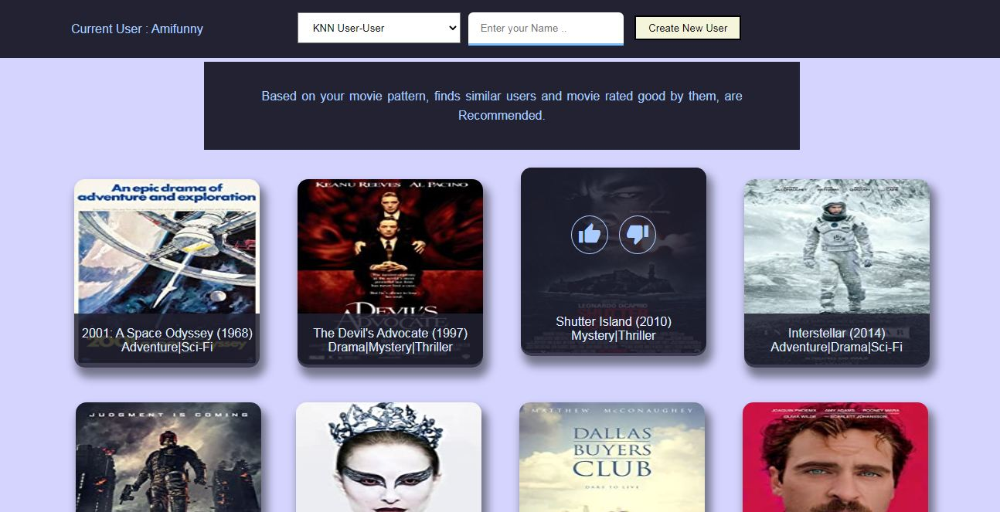

# likely
Likely - is a python application that implements various recommendation methods like KNN, Bandit, and SVD in plug and play style.

We are surrounded by content and our experience depends on various factors and algorithms incorporated together. Maybe you stumbled on this repo by the GitHub recommendation system. This application is an attempt to understand various recommendation methods.

## How to run DEMO
This application uses python 3.x and Flask.
 1. Clone the repo using `git clone https://github.com/amifunny/likely.git` in command line.
 2.  In command line, go inside folder and  use `set FLASK_APP=backend` for windows
	 or to avoid setting this, change `backend.py` to `app.py`.
 3. Start local server using `flask run` 
 4. Go to `http://127.0.0.1:5000/` to interact with demo.
 
		
## Content

- [`likely.py`](https://github.com/amifunny/likely/blob/master/likely.py) : Contains class implementation for recommendation objects.
- [`backend.py`](https://github.com/amifunny/likely/blob/master/backend.py) : Handle routes and call recommender object for movie indices and rendering templates.
- `static/dataset` : Contains Movie Dataset and User Rating dataset.
- `keywords.py` : Auxilary File to create `static/keywords.txt` to get genre for `MultiArmedBandit`

## Feedback System
We used like and dislike button to mark seen movies and assign ratings. As dataset is for rating between 0 to 5, dislike is assumed as 0 adn like as 5 star rating.

## Dataset
For User Ratings and corresponding Movie Titles, [**Movie lens Small dataset**](https://grouplens.org/datasets/movielens/)  was used.
But it had lots of genres missing and also poster of movies to create the UI, so additional dataset from kaggle was used from [here](https://www.kaggle.com/neha1703/movie-genre-from-its-poster).
So finally we had dataset of about ~6000 Movies and ~600 users rating.

## Algorithms

- **Multi Armed Bandit**  -  Classic Reinforcement Learning method to get most reward from probiblistic setting. We use Thompson sampling for exploration purpose. We use number of genres as arms. This method estimates average reward, or how likely users is to click on item with certain keyword.
- **SVD User-Item** - SVD is a matrix decomposition method which in our case, decompose User-Item matrix filled with rating values, into Three matrices. One contains Users' latent vectors, another Items' latent vectors and a weights diagonal matrix. Latent Vectors are nothing but float values determining characterstics of user and Item.

	Doing a simple dot product of particular user with all movies give us 		predicted rating of that user for all movies.
Also each user has their way of rating, so User-Item matrix is normalized by average rating of that user.

-  **SVD+KNN Item-Item** - As Latent Vector of similar items are also similar, we use KNN to get nearest similar movies to the ones that user has already watched.

- **KNN User-User** - Use CSR matrix of User-Item to get similar users on basis of their ratings. Use movie rated good by other user to give recommendations.
- 
